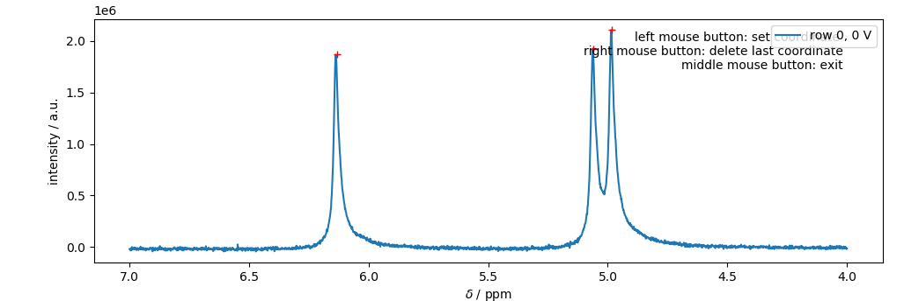
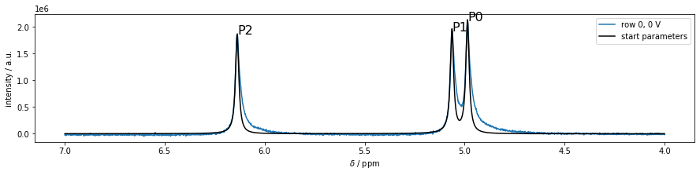
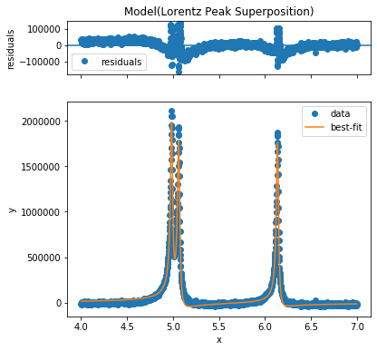

.. _Tutorialpage:

========
Tutorial
========

The following tutorial follows the typical work-flow analyzing an eNMR measurement.
Code marked with >>> is input code, while all other lines are the respective output.

Importing and processing the eNMR spectrum
******************************************

loading the data
----------------
Loading the eNMR data takes place by creating an instance (object) of the respective import class with the respective path and expno of the experiment. This is the most critical point when adapting a different experimental setup to eNMRpy. If you are in need for help, please consider a `pull request on GitHub <https://github.com/Flackermann/eNMRpy>`_.

.. code-block:: python

	>>> import eNMRpy
	>>> m = eNMRpy.Import_eNMR_Measurement(path, expno, dependency='U', lineb=.5, d=2.2e-2, cell_resistance=None)
	

Processing the spectrum (FFT, linebroadening)
---------------------------------------------

Usually, the imported data represents the free induction decay (FID), recorded for the eNMR measurements.
In order to analyze the eNMR measurement, the FID needs to be transformed into a spectrum via Fast Fourier
Transformation (FFT) via the .proc() method.

.. code-block:: python

    >>> m.proc(linebroadening=None, phc0=0, phc1=0, xmin=None, xmax=None):

This method transforms the self.data array from the FID to the spectrum. phc0 and phc1 give the zero and first order phase correction. If xmin and/or xmin are not None, self.set_spectral_region() will be called with the given limits.

**Note:** Please keep in mind, that self.data is changed. It should always be used directly after loading the raw data. Therefore, it is good practice to write self.proc() in the same cell within a jupyter notebook, in order to obtain the correct spectrum after each execution of the respective cell.

Plotting the spectrum
---------------------
After loading the raw data, and processing the spectrum, we want to have a look at the result by plotting the spectrum via the method self.plot_spec(). This method returns a matplotlib figure, `which can be used as usual <https://matplotlib.org/3.1.1/api/_as_gen/matplotlib.pyplot.figure.html>`_. The first argument in self.plot_spec() can be an integer or an array of integers, in order to plot multiple rows of the 2D spectrum on top of each other.

.. code-block:: python

    >>> fullspec = m.plot_spec(rows, figsize=(x,y)); 

Important instance variables
----------------------------

.. table:: important instance variables of the measurement object (in this example **m**) from the .Pavel()-class *(atm standard import class)*

    +-------------------------+---------------------------------------------------------------------------+
    | variable                |               meaning                                                     |
    +=========================+===========================================================================+
    | self.eNMRraw            | contains the phase data, voltage list, and gradient list                  |
    |                         | data for all eNMR experiments                                             |
    +-------------------------+---------------------------------------------------------------------------+
    | self.d                  | electrode distance in m (cell constant)                                   |
    +-------------------------+---------------------------------------------------------------------------+
    | self.Delta              | observation time in s                                                     |
    +-------------------------+---------------------------------------------------------------------------+
    | self.delta              | magnetic field gradient pulse duration                                    |
    +-------------------------+---------------------------------------------------------------------------+
    | self.gamma              | gyromagnetic ratio in °/Ts                                                |
    +-------------------------+---------------------------------------------------------------------------+
    | self.path               | path used to import the data                                              |
    +-------------------------+---------------------------------------------------------------------------+
    | self.expno              | experiment number according to Bruker's syntax                            |
    +-------------------------+---------------------------------------------------------------------------+
    | self.lineb              | line broadening variable used for processing                              |
    +-------------------------+---------------------------------------------------------------------------+
    | self.ppm                | list of chemical shift for each datapoint                                 |
    +-------------------------+---------------------------------------------------------------------------+
    | self.data               | 2D numpy array containing the complex spectral data                       |
    +-------------------------+---------------------------------------------------------------------------+
    | self.nuc                | investigated nucleus                                                      |
    +-------------------------+---------------------------------------------------------------------------+
    | self.title_page         | imported title page from bruker file -> transformed to be used with print |
    +-------------------------+---------------------------------------------------------------------------+
    | self.dependency         | voltage, gradient, or current dependent measurement --> see docstring     |
    +-------------------------+---------------------------------------------------------------------------+
    | self.cell_resistance    | important to calculate the electric field when const. *I* mode is used    |
    +-------------------------+---------------------------------------------------------------------------+

Phase analysis
**************
eNMRpy comes with three different methods for the determination of the electrophoretic mobility.
a) :ref:`Fitting of Lorentzians <lorentzpage>`, b) :ref:`automatic phase correction <autophasepage>`, and c) :ref:`Mobility Ordered SpectroscopY (MOSY) <MOSYpage>`.

.. _lorentzpage:

Approximation of Lorentzian-shaped function
-------------------------------------------
In order to analyze the phase shift via the approximation of Lorentzian shaped profiles, one has to import the submodule *Phasefitting* accordingly:

.. code-block:: python

    >>> from eNMRpy import Phasefitting as phf

Two methods exist for the creation of the `lmfit <https://github.com/lmfit/lmfit-py>`_ fit model.

Peak picking
............

The first model uses the peakpicker() function contained in the Phasefitting module to obtain an array (in this example *peaks*) listing the peaks picked. The peakpicker() function needs the x-coordinate (*m.ppm*) and y-coordinate (here the first spectral row *m.data[0]* of the measurement object *m*), and a threshold below which no peak is picked:

.. code-block:: python

    >>> peaks = phf.peakpicker(m.ppm, m.data[0], threshold=1e5)

Peak selection via GUI
......................

Since the peak picking approach is not always reliable, one can use a GUI for the selection of the individual peaks.

.. code-block:: python

    >>> %matplotlib  qt5          # enables matplotlib to open a GUI outside of the jupyter notebook
    >>> peaks = phf.set_peaks(m)  # starts the GUI
    >>> %matplotlib inline        # returns to the inline-plotting mode for the jupyter notebook

Peaks are selected by a left-click, the last peak can be deleted via a right-click. **Note:** that the red crosses correspond to the clicking points, where the peaks were selected. This is important for estimating the peak's amplitude. **Note:** It is important to close the GUI by either clicking the middle bouse button, or pressing <enter> on the keyboard. Otherwise, the jupyter notebook may be stuck in a while loop.

Creating the fit model and fitting the eNMR measurement
.......................................................
  
The *peaks* array, obtained via one of the two methods described above, is then passed to the *make_model()* wrapper function, returning an instance of the lmfit.Model()-class (named *model* in this example) including the correct parameters set, and Lorentzian function.
    
.. code-block:: python

    >>> model = phf.make_model(peaks, print_params=False)
    
A key aspect of the fitting method is to introduce physically meaningful restrictions to the fitmodel by defining dependencies between parameters. The most straightforward restriction is to set signal phases corresponding to the same molecule equal by using the method self.set_mathematical_constraints(). In this example, *ph0 = ph1 = ph2* hence, only *ph2* is varied in the following fit. (see self.params.pretty_print())

.. code-block:: python

    >>> model.set_mathematical_constraints(['ph0=ph1', 'ph1=ph2'])

The set of parameter can be investigated via:

.. code-block:: python

    >>> model.params.pretty_print()
    Name         Value      Min      Max   Stderr     Vary     Expr Brute_Step
    a0        2.107e+04        0      inf     None     True     None     None
    a1        1.927e+04        0      inf     None     True     None     None
    a2        1.867e+04        0      inf     None     True     None     None
    baseline         1     -inf      inf     None     True     None     None
    l0            0.01        0      inf     None     True     None     None
    l1            0.01        0      inf     None     True     None     None
    l2            0.01        0      inf     None     True     None     None
    ph0              1     -180      180     None    False      ph1     None
    ph1              1     -180      180     None    False      ph2     None
    ph2              1     -180      180     None     True     None     None
    v0           4.985     -inf      inf     None     True     None     None
    v1           5.063     -inf      inf     None     True     None     None
    v2           6.137     -inf      inf     None     True     None     None

Furthermore, it is possible to `manipulate single parameters <https://lmfit.github.io/lmfit-py/parameters.html>`_ according to the documentation of the lmfit package.
    
The initial spectrum can be plotted via model.plot_init_spec(), which takes the x-coordinate *m.ppm* and as an optional argument the 1D figure *fullspec*

.. code-block:: python

    >>> fullspec = m.plot_spec(0); 
    >>> model.plot_init_spec(m.ppm, fig=fullspec);
    

In order to see, whether the initial parameters are well-chosen resulting in a converging fit, a test-fit of the first spectrum can be achieved using the self.fit() method of the fit-model:

.. code-block:: python

    >>> model.fit(m.ppm, m.data[0], plot=True);

In order to fit a whole eNMR measurement, the function Phasefitting.fit_Measurement() is used inserting the measurement object *m*, and the fit model *model*. Using this function, all eNMR spectra in *m* are fitted consecutively, and the results are stored in the m.eNMRraw pandas-DataFrame. **Note:** 

.. code-block:: python

    >>> phf.fit_Measurement(m, model, plot=False, parse_complex='real')
    
The results of the fit can be found in the measurement objects eNMRraw pandas DataFrame. In this example *m.eNMRraw*.

.. _autophasepage:

automatic phase correction
--------------------------

.. _MOSYpage:

MOSY
----

Analyzing the signal intensity after phase correction
*****************************************************

Saving and importing measurements
*********************************

.. toctree::
   :maxdepth: 2
   :caption: Contents:
